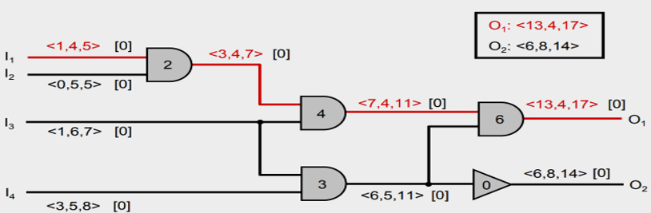
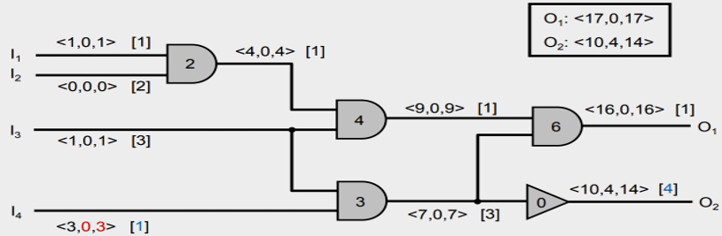

#### Establish timing budgets for nets
- Gate and wire delays must be optimized during timing driven layout design 
- Wire delays depend on wire lengths
- Wire lengths are not known until after placement and routing

#### Delay budgeting with the zero slack algorithm 
- Let vi be the logic gates and ei be the nets 
- Let DELAY(v) and DELAY(e) be the delay of the gate and net, respectively 
- Timing budget TB(v) of a gate corresponds to DELAY(v) + DELAY(e)

#### Example: Use the zero slack algorithm to distribute slack
- Format: <AAT, Slack, RAT>, [timing budget]
- Find the path with the minimum slack
- Distribute the slacks and update the timing budgets

- Before the application of the algorithm

- After the application of the algorithm


#### Forward path search
- Forward Path Search (FORWARD_PATH(vmin,G))
- Input: node vmin with minimum slack slackmin, timing graph G
- Output: maximal downstream path path from vmin such that no node v ∈ V affects the slack of path
```c++
1. path = vmin
2. do
3.  flag = false
4.  node = LAST_ELEMENT(path)
5.  foreach (fanout node fo of node)
6.      if ((RAT[fo] == RAT[node] + TB[fo]) and (AAT[fo] == AAT[node] + TB[fo]))
7.          ADD_TO_BACK(path,fo)
8.          flag = true
9.          break
10. while (flag == true)
11. REMOVE_FIRST_ELEMENT(path) // remove vmin
```

#### Backward path search
- Backward Path Search (BACKWARD_PATH(vmin,G))
- Input: node vmin with minimum slack slackmin, timing graph G
- Output: maximal upstream path path from vmin such that no node v ∈ V affects the slack of path
```c++
1. path = vmin
2. do
3.  flag = false
4.  node = FIRST_ELEMENT(path)
5.  foreach (fanin node fi of node)
6.      if ((RAT[fi] == RAT[node] –TB[fi]) and (AAT[fi] == AAT[node] –TB[fi]))
7.          ADD_TO_FRONT(path,fi)
8.          flag = true
9.          break
10. while (flag == true)
11. REMOVE_LAST_ELEMENT(path) // remove vmin
```

#### Delay Budgeting With the Zero Slack Algorithm
- Input: timing graph G(V,E)
- Output: timing budgets TB for each v ∈ V
```c++
1. do
2.  (AAT,RAT,slack) = STA(G)
3.  foreach (vi ∈V)
4.      TB[vi] = DELAY(vi) + DELAY(ei)
5.  slackmin = ∞
6.  foreach (v ∈ V)
7.      if ((slack[v] < slackmin) and (slack[v] > 0))
8.          slackmin = slack[v]
9.          vmin = v
10. if (slackmin ≠ ∞)
11.     path = vmin
12.     ADD_TO_FRONT(path,BACKWARD_PATH(vmin,G))
13.     ADD_TO_BACK(path,FORWARD_PATH(vmin,G))
14.     s = slackmin / |path|
15.     for (i = 1 to |path|)
16.         node = path[i] // evenly distribute
17.         TB[node] = TB[node] + s // slack along path
18. while (slackmin ≠ ∞)
``` 